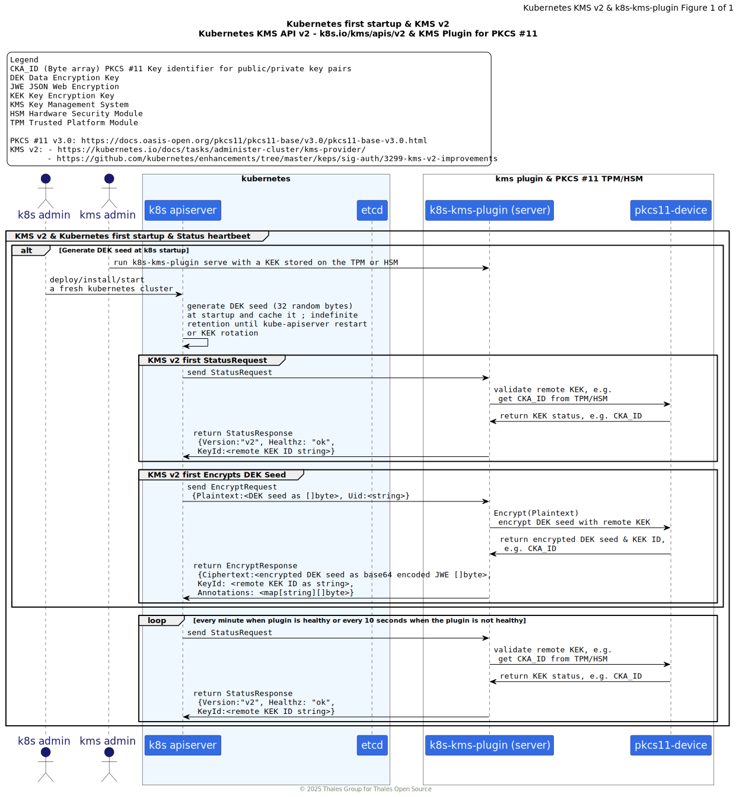
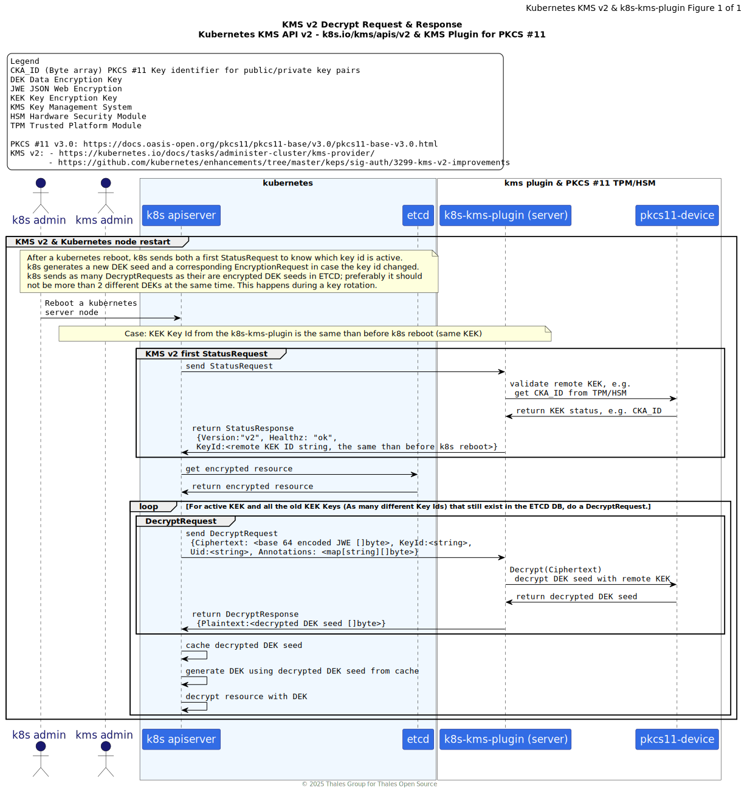
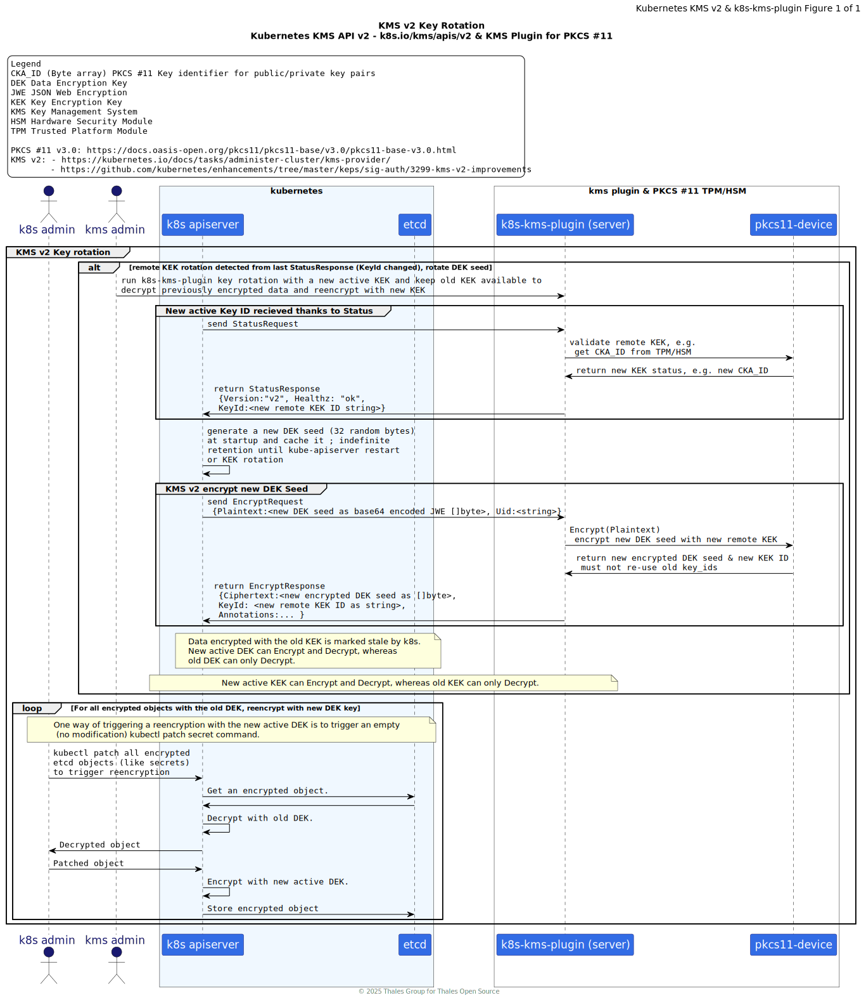
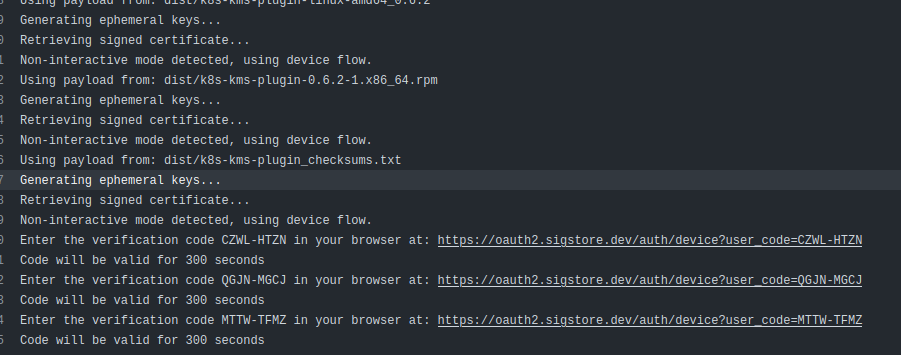
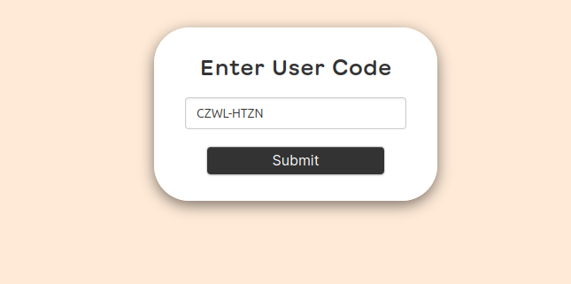

# `k8s-kms-plugin` 🔐

[](./LICENSE)
[](https://github.com/ThalesGroup/k8s-kms-plugin/actions/workflows/Goreleaser.yaml)

`k8s-kms-plugin serve` implements the [Kubernetes KMS v2 API](https://pkg.go.dev/k8s.io/kms/apis/v2) protocol as a gRPC service that leverages a remote or local HSM via PKCS11.
`k8s-kms-plugin serve rotation` supports key rotation operations.

This plugin will also run in proxy mode which can connect to a remote plugin service running in a secure network device (Key Managers)

> ⚠️ **Droping support of KMS v1**: Newer version of the `k8s-kms-plugin` droped support for [Kubernetes KMSv1](https://pkg.go.dev/k8s.io/kms@v0.34.1/apis/v1beta1),
> as KMSv1 is deprecated in Kubernetes v1.28 and disabled by default since Kubernetes v1.29.

> 🚧 **Note**: This documentation is under construction and needs to be updated to remove/archive references to KMS v1 and
> document KMS v2 operations.

# 🚤 Quick Start 🚀

TL;DR: For a quick start experience, try the `k8s-kms-plugin` with software (virtual) HSM such as:

- [SoftHSMv2 & `k8s-kms-plugin`](./docs/softhsm-v2.md)
- [Software TPM Emulator & `k8s-kms-plugin`](./docs/software-tpm-emulator.md)

# Table of Contents

- [1. Definions \& Accronyms 🔎](#1-definions--accronyms-)
- [2. Overview 🔭](#2-overview-)
  - [2.1. Architecture](#21-architecture)
  - [2.2. Deployment Scenarios Examples](#22-deployment-scenarios-examples)
  - [2.3. Key Rotation Support](#23-key-rotation-support)
- [3. Installation 🔧](#3-installation-)
  - [3.1. kubernetes Requirements](#31-kubernetes-requirements)
    - [3.1.1. `k3s` kubernetes example](#311-k3s-kubernetes-example)
  - [3.2. Install `k8s-kms-plugin` From Official Packages](#32-install-k8s-kms-plugin-from-official-packages)
    - [3.2.1. `apk` on Wolfi OS packages](#321-apk-on-wolfi-os-packages)
    - [3.2.2. `archlinux` packages](#322-archlinux-packages)
    - [3.2.3. `deb` debian packages](#323-deb-debian-packages)
    - [3.2.4. `rpm` RPM packages](#324-rpm-rpm-packages)
    - [3.2.5. Binary](#325-binary)
  - [3.3. Build `k8s-kms-plugin` locally from Source with `make`](#33-build-k8s-kms-plugin-locally-from-source-with-make)
    - [3.3.1. Build Requirements](#331-build-requirements)
    - [3.3.2. Standard x86 Linux Build](#332-standard-x86-linux-build)
    - [3.3.3. Debug x86 Linux Build](#333-debug-x86-linux-build)
  - [3.4. Build `k8s-kms-plugin` **locally** from Source with `goreleaser`](#34-build-k8s-kms-plugin-locally-from-source-with-goreleaser)
- [4. Documentation, Usage \& User Guides 📚](#4-documentation-usage--user-guides-)
  - [4.1. CLI Help Messages](#41-cli-help-messages)
  - [4.2. CLI Auto Completion for `bash`, `fish`, `zsh`](#42-cli-auto-completion-for-bash-fish-zsh)
  - [4.3. CLI Auto Generated Documentation](#43-cli-auto-generated-documentation)
  - [4.4. User Input Priority: CLI \> Env Vars \> Config File \> Default](#44-user-input-priority-cli--env-vars--config-file--default)
  - [4.5. 🚤 Quick Start 🚀](#45--quick-start-)
  - [4.6. HSM \& TPM Supported Platforms](#46-hsm--tpm-supported-platforms)
- [5. Development Environment 🔬](#5-development-environment-)
- [6. Debug Environment 🐛](#6-debug-environment-)
  - [6.1. `delve` Remote Debug](#61-delve-remote-debug)
  - [6.2. `vscode` Debug](#62-vscode-debug)
- [7. Vulnerability check 💣](#7-vulnerability-check-)
- [8. Signing artifacts 📝](#8-signing-artifacts-)
- [9. Verifying the authenticity of an artifact 📝🔍](#9-verifying-the-authenticity-of-an-artifact-)
- [10. Verifying the SLSA attestation of a container](#10-verifying-the-slsa-attestation-of-a-container)

## 1. Definions & Accronyms 🔎

| Term         | Definition                            |
|--------------|---------------------------------------|
| **DEK**      | Data Encryption Key                   |
| **HA**       | High Availability                     |
| **HSM**      | Hardware Security Module              |
| **k3s**      | A Lightweight Kubernetes Distribution |
| **k8s**      | Kubernetes (short for)                |
| **KEK**      | Key Encryption Key                    |
| **KMS**      | Key Management System                 |
| **PKCS #11** | Public Key Cryptography Standard #11  |
| **TPM**      | Trusted Platform Module               |

## 2. Overview 🔭

### 2.1. Architecture

The [`k8s-kms-plugin`](https://github.com/ThalesGroup/k8s-kms-plugin) uses `gose`  and `crypto11`:

- [github.com/ThalesGroup/gose](https://github.com/ThalesGroup/gose): support in GoLang for JOSE JSON Objects Signing and Encryption;
- [github.com/ThalesGroup/crypto11](https://github.com/ThalesGroup/crypto11): Implements crypto.Signer abd crypto.Decrypter for PKCS#11 devices;
- [k8s.io/kms/apis/v2](https://pkg.go.dev/k8s.io/kms/apis/v2) (source code: https://github.com/kubernetes/kms): KMS v2 API & gRPC protobuf API files.

> 🚧 Note: We will work on providing a full nested SBOM later.

Figure below sums up the main dependencies of `k8s-kms-plugin`:


### 2.2. Deployment Scenarios Examples

The following sequence diagram illustrates the communication between `kubernetes` ([KMS v2 API](https://pkg.go.dev/k8s.io/kms/apis/v2)), `k8s-kms-plugin`, and a [PKCS #11](https://docs.oasis-open.org/pkcs11/pkcs11-base/v3.0/pkcs11-base-v3.0.html) capable device like a TPM or HSM.

<details>
<summary>➡️ click here to show 🔦 k8s-kms-plugin & KMS v2 API Sequence Diagram </summary>







</details>

> This diagram was inspired by those from https://github.com/kubernetes/enhancements/tree/master/keps/sig-auth/3299-kms-v2-improvements

The figure below illustrates several example of how the `k8s-kms-plugin` can be deployed for a Kubernetes Single Node cluster and using an embedded TPM or an HSM as a PKCS #11 capable key store.


The `k8s-kms-plugin` also supports kubernetes cluster in HA mode (at least 3 server nodes), as long as the KEK is the same for each kubernetes node in the HA cluster. Otherwise it will fail to work with the Raft consensus algorithm for the synchronization of the content of the etcd cluster.


<details>
<summary>➡️ click here to show 🔦 other HA k8s-kms-plugin deployments</summary>


</details>

### 2.3. Key Rotation Support

Look at [`k8s-kms-plugin serve rotation`](./docs/cli-user-interface/markdown/k8s-kms-plugin_serve_rotation.md) for examples.

Figures below illustrate a Key Rotation sequence. First the KEK is stored on a TPM. Then rotation is being performed to use a USB HSM to store the new KEK.


## 3. Installation 🔧

### 3.1. kubernetes Requirements

`k8s-kms-plugin` is designed for kubernetes clusters that are using version v1.29 or higher and implements the [KMS v2 API](https://pkg.go.dev/k8s.io/kms/apis/v2). See also:
https://kubernetes.io/docs/tasks/administer-cluster/kms-provider/

⚠️ `k8s-kms-plugin` **does not support KMS v1** which is deprecated in Kubernetes v1.28 and disabled by default since Kubernetes v1.29.

To serve the `k8s-kms-plugin` for encryption operations from Kubernetes, you will need at least one AES or RSA key in a supported PKCS #11 provider.

#### 3.1.1. `k3s` kubernetes example

We use `k3s` as an example of a Kubernetes distribution that supports [KMS v2](https://pkg.go.dev/k8s.io/kms/apis/v2).

Assuming you have configured a PKCS #11 TPM or HSM, you can start the `k8s-kms-plugin`:

```bash
k8s-kms-plugin \
  serve \
    --log-level=trace \
    --socket /run/user/1000/k8s-kms-plugin.sock \
    --p11-lib /usr/lib64/pkcs11/libtpm2_pkcs11.so \
    --p11-label mylabel \
    --p11-pin mypin \
    --kek-id 33653932616130656634343238346163 \
    --algorithm rsa-oaep
```

> This example uses [`Software TPM Emulator`](https://github.com/stefanberger/swtpm).

Then review the content of file [`encryption-conf-kmsv2-unix-socket.yaml`](./deployments/k8s/encryption-conf-kmsv2-unix-socket.yaml).
Make sure `resources.providers.kms.endpoint` points to the same unix socket file of the running `k8s-kms-plugin`.

Then install `k3s` with the following command:

```bash
curl -sfL https://get.k3s.io | K3S_DEBUG=true INSTALL_K3S_VERSION=v1.33.1+k3s1 sh -s - \
  --write-kubeconfig-mode 660 \
  --kube-apiserver-arg=encryption-provider-config=$HOME/k8s-kms-plugin/deployments/k8s/encryption-conf-kmsv2-unix-socket.yaml
```

### 3.2. Install `k8s-kms-plugin` From Official Packages

As of now, `k8s-kms-plugin`'s Github Action Build Recipe supports building `apk`, `deb`, `rpm` and `archlinux` for
Linux x86 platform. Check the different package artefacts from the [releases](https://github.com/ThalesGroup/k8s-kms-plugin/releases)
tab.

> 🚧 **Note**: The packages are not available on official repos yet.
> And signature remains to be added in the CICD build recipe.
> Therefore, this doc only shows local installation of the package.

#### 3.2.1. `apk` on Wolfi OS packages

For now, `k8s-kms-plugin` does not support installation on Alpine Linux. Indeed, for now we are not building the `k8s-kms-plugin` package with the musl libc. We only support the glibc.

But `k8s-kms-plugin` supports installation on Wolfi OS as it uses the glibc.

Until the packages are available on official repos and signed, you can install the package from the following command:

Example on Wolfi OS:

```bash
apk add --allow-untrusted ./k8s-kms-plugin_SNAPSHOT-3239cd9_x86_64.apk
```

#### 3.2.2. `archlinux` packages

See https://wiki.archlinux.org/title/Pacman#Additional_commands

Command should look like this:

```bash
pacman -U ./k8s-kms-plugin-SNAPSHOT-3239cd9-1-x86_64.pkg.tar.zst
```

However, pacman needs a version that follows semantic versionning. Make sure you use the right package that uses semver, otherwise you get this error:

```
error: invalid metadata for package k8s-kms-plugin-SNAPSHOT-3239cd9-1 (package version contains invalid characters)
error: './k8s-kms-plugin-SNAPSHOT-3239cd9-1-x86_64.pkg.tar.zst': invalid or corrupted package
```

#### 3.2.3. `deb` debian packages

If you wish to install a snapshot version of `k8s-kms-plugin` (not following semantic versionning), you will need to use the following command `dpkg -i --force-all` to force the installation of the package. Otherwise, `dpkg` will fail with the following error:

```bash
$ sudo dpkg -i ./k8s-kms-plugin_SNAPSHOT-3239cd9_amd64.deb 
```
```
dpkg: error processing archive ./k8s-kms-plugin_SNAPSHOT-3239cd9_amd64.deb (--install):
 parsing file '/var/lib/dpkg/tmp.ci/control' near line 2 package 'k8s-kms-plugin':
 'Version' field value 'SNAPSHOT-3239cd9': version number does not start with digit
Errors were encountered while processing:
 ./k8s-kms-plugin_SNAPSHOT-3239cd9_amd64.deb
```

"Force" will only raise a warning:

```bash
dpkg --force-all -i ./k8s-kms-plugin_SNAPSHOT-3239cd9_amd64.deb
```

```
dpkg: warning: parsing file '/var/lib/dpkg/tmp.ci/control' near line 2 package 'k8s-kms-plugin':
 'Version' field value 'SNAPSHOT-3239cd9': version number does not start with digit
Selecting previously unselected package k8s-kms-plugin.
(Reading database ... 6089 files and directories currently installed.)
Preparing to unpack .../k8s-kms-plugin_SNAPSHOT-3239cd9_amd64.deb ...
Unpacking k8s-kms-plugin (SNAPSHOT-3239cd9) ...
Setting up k8s-kms-plugin (SNAPSHOT-3239cd9) ...
```

#### 3.2.4. `rpm` RPM packages

```bash
dnf install ./k8s-kms-plugin-SNAPSHOT-3239cd9-1.x86_64.rpm
```

#### 3.2.5. Binary

Move the `k8s-kms-plugin` binary to a relevant location under your `$PATH`, for example `/usr/local/bin/k8s-kms-plugin`.

### 3.3. Build `k8s-kms-plugin` locally from Source with `make`

#### 3.3.1. Build Requirements

You should have `make`, `git` and `go` installed. Review the content of the [`Makefile`](./Makefile) file for more details.

**`CGO`** is required to build the plugin: **make sure you are using the right C Library** (glibc or musl) for your target
environment. Do not build on musl libc if you intend to use the plugin on a non-musl environment (glibc).

Build was tested with:

```bash
make --version
```
```
GNU Make 4.4.1
Construit pour x86_64-pc-linux-gnu
Copyright (C) 1988-2023 Free Software Foundation, Inc.
License GPLv3+: GNU GPL version 3 or later <https://gnu.org/licenses/gpl.html>
This is free software: you are free to change and redistribute it.
There is NO WARRANTY, to the extent permitted by law.
```

GoLang

```bash
go version
```
```
go version go1.23.9 linux/amd64
```

Git

```bash
git version
```
```
git version 2.50.1
```

#### 3.3.2. Standard x86 Linux Build

Run

```bash
make build
```

You should get a `k8s-kms-plugin` binary in the current directory.

#### 3.3.3. Debug x86 Linux Build

Run

```bash
make build-debug
```

You should get a `k8s-kms-plugin` binary in the current directory.

### 3.4. Build `k8s-kms-plugin` **locally** from Source with `goreleaser`

This section allows you to locally test the [`goreleaser`](https://github.com/goreleaser/goreleaser) Github Action Build
Recipe. It generates the same artefacts that the one generated by the Github Action CICD pipeline, but locally.

These commands are executed in `bash`. If you use other shells like `fish`, you might need to adjust the environment
variables export.

```bash
export LDFLAGS=$(make get-ldflags)
export WORKSPACE=/pwd
export GITHUB_REPOSITORY_OWNER=localfakegithubowner
```

As of now, we choose to configure `.goreleaser.yml` so that `goreleaser` gets the content of `LDFLAGS` from an
environment variable. This allows us to use the same `LDFLAGS` for the `make` build procedure as well as the
`goreleaser` build, without having to set `LDFLAGS` twice (once in `.goreleaser.yml`, and once in `Makefile`.).

`goreleaser` will fail if you do not provide a value for `GITHUB_REPOSITORY_OWNER`. We suggest using a fake value.
During a real Github Action run, the value will be provided by the `GITHUB_REPOSITORY_OWNER` environment variable set
by GA.

`goreleaser` will fail if you do not provide a value for `WORKSPACE`. During a real Github Action run, the value will be
provided by GA.

Then you can either install and run `goreleaser` locally, or (preferably) you can use `podman` to run `goreleaser`
inside an interactive container. Below is the `podman` command to run `goreleaser` locally.

```bash
podman run -it --rm \
        -v $PWD:/pwd \
        --workdir /pwd \
        -e LDFLAGS=$LDFLAGS \
        -e WORKSPACE=$WORKSPACE \
        -e GITHUB_REPOSITORY_OWNER=$GITHUB_REPOSITORY_OWNER \
        --platform "linux/amd64" \
        ghcr.io/thalesgroup/goreleaser-glibc-image:golang-1.25.1-bookworm \
          release \
            --clean \
            --snapshot \
            --skip sign,publish,validate,ko,sbom
```

We use a custom [`ghcr.io/thalesgroup/goreleaser-glibc-image`](https://github.com/ThalesGroup/goreleaser-glibc-image/pkgs/container/goreleaser-glibc-image) image to build `k8s-kms-plugin`, because the default [`ghcr.io/goreleaser/goreleaser`](https://github.com/goreleaser/goreleaser/pkgs/container/goreleaser) container image does not use the standard `glibc` libraries,
but uses MUSL libc (found on Alpine Linux).
To run on standard linux (not musl), `k8s-kms-plugin` needs to use standard `glibc` libraries as CGO is enabled.

You can also check out [`ghcr.io/goreleaser/goreleaser-cross`](https://github.com/goreleaser/goreleaser-cross/pkgs/container/goreleaser-cross),
which supports standard `glibc`.

Or you can create your own custom image, based on the examples from https://github.com/ThalesGroup/goreleaser-glibc-image.

## 4. Documentation, Usage & User Guides 📚

🐎 **TL;DR**: The main commands you need are [`k8s-kms-plugin serve`](./docs/cli-user-interface/markdown/k8s-kms-plugin_serve.md) and [`k8s-kms-plugin serve rotation`](./docs/cli-user-interface/markdown/k8s-kms-plugin_serve_rotation.md).

### 4.1. CLI Help Messages

`k8s-kms-plugin` uses the [spf13/cobra](https://github.com/spf13/cobra) CLI framework to generate the help messages.
We recommend the user to use the `-h` and `--help` flags to get the help messages.

### 4.2. CLI Auto Completion for `bash`, `fish`, `zsh`

`k8s-kms-plugin` supports auto-completion for `bash`, `fish`, `zsh` shells. We recommend to use the auto-completion for
a better user experience.

See details: [`k8s-kms-plugin completion`](./docs/cli-user-interface/markdown/k8s-kms-plugin_completion.md)

Example for `fish`:

```bash
k8s-kms-plugin completion fish > ~/.config/fish/completions/k8s-kms-plugin.fish
```

### 4.3. CLI Auto Generated Documentation

A snapshot of the `k8s-kms-plugin` CLI documentation is available here [`docs/cli-user-interface/markdown/README.md`](./docs/cli-user-interface/markdown/README.md).

> _Auto generated_ documentation files are marked with footer `###### Auto generated by spf13/cobra on 31-Jul-2025` to indicate that they are auto-generated.

The CLI documentation can be generated with the `k8s-kms-plugin docs` command:

```bash
$ k8s-kms-plugin docs -f cli-table-pretty -o docs/cli-user-interface/txt/
$ k8s-kms-plugin docs -f markdown -o docs/cli-user-interface/markdown/
```

### 4.4. User Input Priority: CLI > Env Vars > Config File > Default

`k8s-kms-plugin` allows users to configure its settings through multiple sources, with the highest priority given to
CLI flags, followed by environment variables, and then configuration files.
The default settings are used if no other sources provide a value.

Each CLI flag (e.g. `--log-level`) has a corresponding environment variable (e.g. `KMS_K8S_PLUGIN_LOG_LEVEL`) and a config file entry (e.g. `log-level` in YAML/TOML/JSON).

A recap of all `k8s-kms-plugin` subcommands, flags, and environment variables is available here [`./docs/cli-user-interface/markdown/cli-env-var-table.md`](./docs/cli-user-interface/markdown/cli-env-var-table.md) or here [`./docs/cli-user-interface/txt/cli-env-var-table.txt`](./docs/cli-user-interface/txt/cli-env-var-table.txt) (txt).

| User Input Source        | Priority Order                  | Example                             |
|--------------------------|---------------------------------|-------------------------------------|
| 1️⃣ CLI Flag             | Highest priority                | `--log-level debug`                 |
| 2️⃣ Environment Variable | Overrides config file & default | `KMS_K8S_PLUGIN_LOG_LEVEL=trace`    |
| 3️⃣ Config File          | Overrides default               | `log-level: warn` in YAML/TOML/JSON |
| 4️⃣ Default Value        | Used if nothing else is set     | `info` (from Cobra init)            |

Flags are handled by [Cobra](https://github.com/spf13/cobra), environment variables, and config files are handled by
[Viper](https://github.com/spf13/viper) with some customizations [`viper-patch-sub.go`](./cmd/k8s-kms-plugin/cmd/viper-patch-sub.go)
to patch the binding between Cobra and Viper.

### 4.5. 🚤 Quick Start 🚀

For a quick start experience, try the `k8s-kms-plugin` with software (virtual) HSM such as:

- [SoftHSMv2 & `k8s-kms-plugin`](./docs/softhsm-v2.md)
- [Software TPM Emulator & `k8s-kms-plugin`](./docs/software-tpm-emulator.md)

### 4.6. HSM & TPM Supported Platforms

> 🚧 **Note**: This section will improve with reference to specific `k8s-kms-plugin` version once
> the release & CICD are set up.

The following table sums up the HSMs or TPMs that has been _officially_ tested & confirmed to work
with the `k8s-kms-plugin`. This list is not exhaustive: you can contribute to it, as other HSM
devices or virtual HSM might work with the `k8s-kms-plugin`.

| [`k8s-kms-plugin` version `XX`]()                                                                  | HSM or TPM   | Form factor  | AES GCM          | AES CBC HMAC     | RSA OAEP         | Comment                               | Docs Details                            |
|----------------------------------------------------------------------------------------------------|--------------|--------------|------------------|------------------|------------------|---------------------------------------|-----------------------------------------|
| [`SoftHSMv2`](https://github.com/softhsm/SoftHSMv2)                                                | HSM PKCS #11 | Software     | ✅Success         | 🚫not applicable | 🚫not applicable | softhsm does not support AES CBC HMAC | [Link](./docs/softhsm-v2.md)            |
| [`Software TPM Emulator`](https://github.com/stefanberger/swtpm)                                   | TPM PKCS #11 | Software     | 🚫not applicable | ✅Success         | ✅Success         | vTPM 2.0 does not support AEG GCM     | [Link](./docs/software-tpm-emulator.md) |
| [Thales eToken Fusion](https://cpl.thalesgroup.com/access-management/authenticators/etoken-fusion) | HSM PKCS #11 | Hardware USB | ❔Not Tested      | ❔Not Tested      | ✅Success         |                                       | [Link](./docs/thales-etoken-fusion.md)  |
| [yubico YubiHSM 2](https://docs.yubico.com/hardware/yubihsm-2/hsm-2-user-guide/index.html)         | HSM PKCS #11 | Hardware USB | ❔Not Tested      | ❔Not Tested      | ✅Success         | RSA 4096 tested                       | [Link](./docs/yubico-yubihsm2.md)       |

## 5. Development Environment 🔬

> 🚧 **TODO**: This section needs to be reworked, as part of this is explanation
> are outdated.

`k8s` houses some sample client and server deployments for e2e testing until such time as this plugin is 100% network functional,
and we can move it to a CICD pattern, as we'll have many actors to coordinate.

All apis are defined in the `/apis` dir, and as we iterate on the spec docs, one must then run `make gen` and refactor
until the 2 stacks come up

Both EST and KMS-Plugin binaries are in the `/cmd` dir

The `Makefile` contains commands for easy execution:
- `make gen` - generates all apis into gRPC or OpenAPI Servers and Clients
- `make dev` - loads project into your kubernetes cluster (minikube or GKE will work just fine), and continuously builds and deploys as you develop.
- `make build` - builds the standalone `k8s-kms-plugin` binary

If you need to build using `crypto11` and `gose` development branches :

1. Push your dev modifications in a dedicated branch in the `crypto11` repo (ex: my-dev-branch)
2. Go to the `gose` repo and update the *go.mod* file with `crytpo11` dev branch and push the update :

```sh
# In gose repo
# in a dev branch
go switch -c my-dev-branch
GOPROXY=direct go get -u github.com/ThalesGroup/crypto11@my-dev-branch
go mod tidy
git add go.mod
git commit -S -s -m "dev: update gose with crytpo11 dev changes"
git push
```

3. Go to the `k8s-kms-plugin` repo and update the *go.mod* file with `crytpo11` and `gose` dev branches, then build :

```sh
go switch -c my-dev-branch
GOPROXY=direct go get -u github.com/ThalesGroup/crypto11@my-dev-branch
GOPROXY=direct go get -u github.com/ThalesGroup/gose@my-dev-branch
go mod tidy
make build
```

## 6. Debug Environment 🐛

### 6.1. `delve` Remote Debug

For a remote debug, build the plugin with debug mode :

```sh
go get github.com/go-delve/delve/cmd/dlv
make build-debug
```

It will generate a binary `k8s-kms-plugin` that can be used with Delve for debug purpose.
Do not use this binary in a production environment.

### 6.2. `vscode` Debug

## 7. Vulnerability check 💣

> 🚧 TODO: This will be done via CICD

```sh
$ govulncheck ./...
Scanning your code and 288 packages across 34 dependent modules for known vulnerabilities...

No vulnerabilities found.
```

## 8. Signing artifacts 📝

> 🚧 TODO: This section needs to be updated.

During the release workflow, certificates and signatures of artifacts are generated.
They are signed by a tool named cosign using a keyless mode.
It required an authentication by clicking in links present in logs.



Once you click on one, you can submit a verification code that will redirect you to three types of authentication. Then click on Github authentication.

 

Do these actions for every authentication links and the signatures and the certificates will be generated with the artifacts in the release.

## 9. Verifying the authenticity of an artifact 📝🔍

> 🚧 TODO: This section needs to be updated.

You need to downloads 3 files : [ _**[file.txt]**_, _**[file].pem**_, _**[file].sig**_]

If you don't have, install cosign by typing the commands below :

  ```bash
  curl -O -L "https://github.com/sigstore/cosign/releases/latest/download/cosign-linux-amd64"
  sudo mv cosign-linux-amd64 /usr/local/bin/cosign
  sudo chmod +x /usr/local/bin/cosign
  ```

For a verification with cosign installed and pay attention to modify the name of the files :

  ```bash
  COSIGN_EXPERIMENTAL=1 cosign verify-blob --cert [file]-keyless.pem --signature [file]-keyless.sig --certificate-oidc-issuer "https://github.com/login/oauth" --certificate-identity [ Mail adress of the owner of the repo ] [file]
  ```

Or using Podman without installing cosign :

```bash
podman run --rm -it gcr.io/projectsigstore/cosign:v1.13.0 COSIGN_EXPERIMENTAL=1 cosign verify-blob --cert [file]-keyless.pem --signature [file]-keyless.sig --certificate-oidc-issuer "https://github.com/login/oauth" --certificate-identity [ Mail adress of the owner of the repo ] [file]
```

## 10. Verifying the SLSA attestation of a container

> 🚧 TODO: This section needs to be updated.

The image's attestation of provenance has been issued by a specific oidc-issuer that is 'https://token.actions.githubusercontent.com' in this repository.
In the next command example, it is required to replace digest by the digest of the image that needs to be verified and the owner of the repo.

```bash
cosign verify-attestation \
      --type slsaprovenance \
      --certificate-identity-regexp="https://github.com/slsa-framework/slsa-github-generator/.github/workflows/generator_container_slsa3.yml@refs/tags/*" \
      --certificate-oidc-issuer="https://token.actions.githubusercontent.com" \
      ghcr.io/OWNER/k8s-kms-plugin@digest | jq .payload -r | base64 --decode | jq
```
